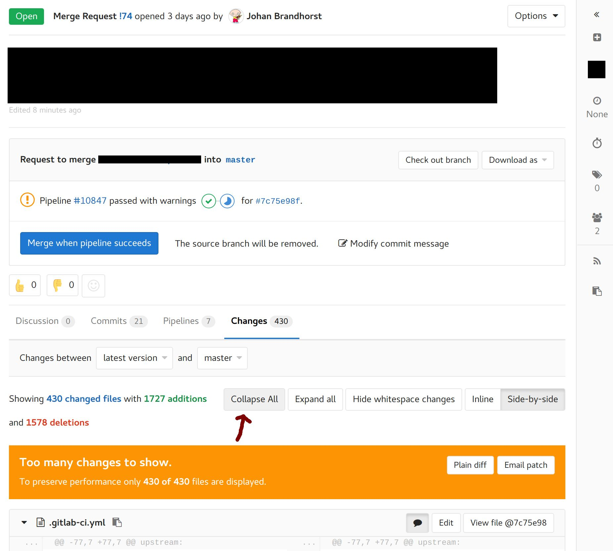
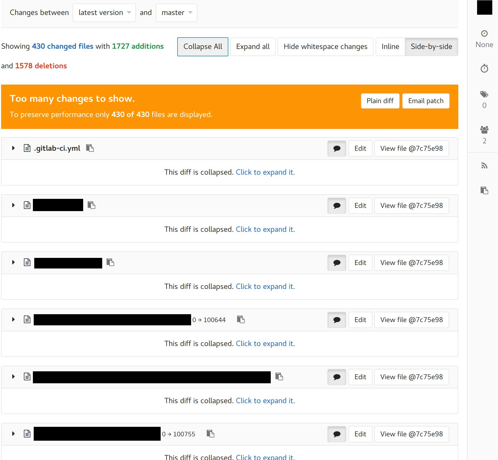

# collapse-gitlab-files
A small userscript for collapsing all files on a GitLab merge request diffs page. Can be used by either
[Greasemonkey](https://addons.mozilla.org/en-GB/firefox/addon/greasemonkey/) for Firefox or
[Tampermonkey](https://chrome.google.com/webstore/detail/tampermonkey/dhdgffkkebhmkfjojejmpbldmpobfkfo?hl=en)
for Google Chrome.

# Installation
With [Tampermonkey](https://chrome.google.com/webstore/detail/tampermonkey/dhdgffkkebhmkfjojejmpbldmpobfkfo?hl=en) installed,
simply navigate to [the raw user.js file](https://github.com/johanbrandhorst/collapse-gitlab-files/raw/master/collapse-all-gitlab-diffs.user.js)
and it should prompt you to install the script. You should of course inspect the JS first and ensure it doesn't do anything nasty.

# Look

Mad arrow drawing skills

